## Data Agents + Fast & Simple
What if there was a way to build a Fabric Data Agent where it felt less like deciphering ancient hieroglyphics and more like ordering your favorite coffee?
Good news! With a little help from Copilot in Power BI, you can skip the guesswork, the endless documentation, the “where did I save those notes?” puzzle as well as the “what’s a schema?” panic. Just ask Copilot eight smart questions, copy/paste the answers, and voilà—your agent is ready to roll. No code, no drama, just pure BI magic.
This guide is for anyone who likes speed, quality, and a little bit of tech wizardry. If you want to automate at scale, stay tuned for a future post!

## Real-World Use Case
You have Power BI semantic models (datasets) in use today and want to create Fabric data agents for them, but you do not really know where to start, you keep getting stuck, or you want to work smarter, not harder. Perhaps the models are not documented or figuring out how to write the instructions is a challenge – or both. Copilot in Power BI to the rescue!

## Scope
It is important to note that this method generates a ‘general’ data agent in a low code / no code approach where the source is a semantic model that was developed using modeling best practices and is AI-Ready. Not to worry though, I will be writing about all kinds of variants… more on this later.

## Before You Start
Before you can use these features, make sure you satisfy the requirements for the use of Copilot and Fabric data agents. You will also need a Power BI semantic model. I have included a Git repo with the files referenced in this post to make it easy for everyone to follow along. Microsoft also provides many sample reports that you can use to get familiar with Power BI.

## Process at a Glance
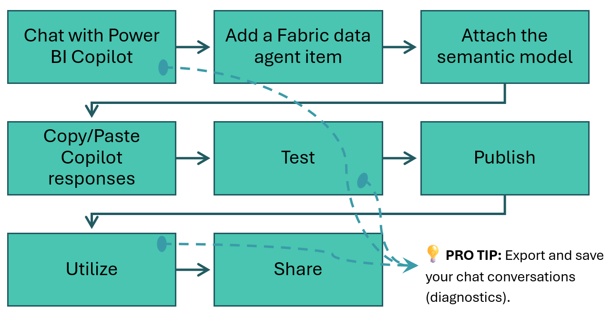

## The Semantic Model
The semantic model is a standard star schema. For more info on star schemas see: [Understand star schema and the importance forPower BI
- Explicit measures are defined in a dedicated table named _Measures.
- The Sales table is the fact table and is hidden.
- Dimension/lookup tables have a one-to-many, single direction relationship with the Sales table.
- Automatic aggregations are not enabled on any columns.
- Hierarchies are present on some dimension/lookup tables.
- Tables, columns and measures have user-friendly, logical names.
- The Dates table has an active relationship with Order Date and an inactive relationship with Ship Date.
- 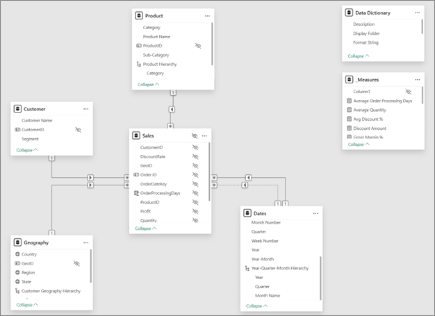

## Chat with Copilot in a Power BI Report
Open a Power BI report in either the Power BI Desktop application or on the web, open the Copilot pane and send each of the messages below in the chat. I have tried several variations on these messages which I will be writing about in a future post.
- Gather all the information about the model that we want to provide to the data agent into the conversation.
- Use the conversation to generate the inputs to configure the data agent.
- Write test cases for the data agent and provide us with the expected answers.
- 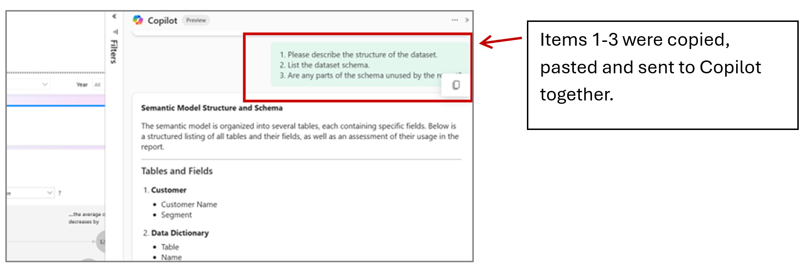

PRO TIPS:
- The order matters. I experimented with several variations and got the best results with this set and order.
- Copy/paste and send a few items at a time; the Power BI Copilot chat allows up to 500 characters so you can knock these out with about 5 copy/paste rounds. This can go even faster by enabling your clipboard to hold multiple items (think clip-clip-clip, paste-paste-paste!) Check out [these instructions for Windows 10](https worry about copying any of the responses from Copilot until after you have sent all messages.
- Read the explanation of each item's value at the end of this post.

### Messages to Send to Copilot
- Describe the structure of the dataset.
- List the dataset schema.
- Are any parts of the schema unused by the report?
- List the data's explicit measures and calculations.
- Explain how each explicit measure is defined and used.
- List all relationships between tables, including cardinality and filter direction.
- Provide all hierarchies and role-playing dimensions (e.g., Date roles like Order Date, Ship Date).
- Using the model’s metadata, list synonyms (terms), alternative names and properties for entities, measures, columns, and business terms.
- Identify any calculation groups or time-intelligence patterns (e.g., YoY, MoM).
- Specify grain constraints for measures (e.g., daily vs monthly validity).
- Provide performance considerations (e.g., large tables, avoid certain joins, preferred filters).
- List common business questions and their expected measures/dimensions.
- Provide any denylist or whitelist for tables/columns beyond unused schema parts.
- Include narrative guidance for KPIs (e.g., how to explain margin changes or discount impact).
- Write detailed AI data agent instructions using the information provided in this conversation. Use as many details as possible, up to 15000 characters with all Markdown syntax (hashes for headings, double asterisks for bold, hyphens for lists, etc.) shown as plain text for copy/paste into another editor or system. Add these three sections at the beginning:
  ## 1. Task:
  ## 2. Output Requirements:
  ## 3. Mandatory Rules:
- Write 2-3 sentences to describe this data agent that will be displayed in “About” info to users.
- Write 2-3 sentences to provide context when the agent appears in other experiences and for automated systems to use when deciding whether to use this agent.
- Write 5-10 test cases for a Fabric data agent connected to the semantic model. The test cases MUST only include scenarios that align to the functionality of the Fabric data agent. When the expected response for a given test case does not vary based on a user's selection, include the value(s) expected instead of a reference of how to find them. Order the test cases by least complex to most complex.

## Create the Fabric Data Agent
Add a new item to your workspace and choose Data agent (preview) and give your agent a descriptive name (e.g., “Retail Office Supplies Agent Demo”).
- 
- 

## Add a Data Source
Choose your semantic model and select the tables the agent should utilize. Select all tables to follow along with the demo.
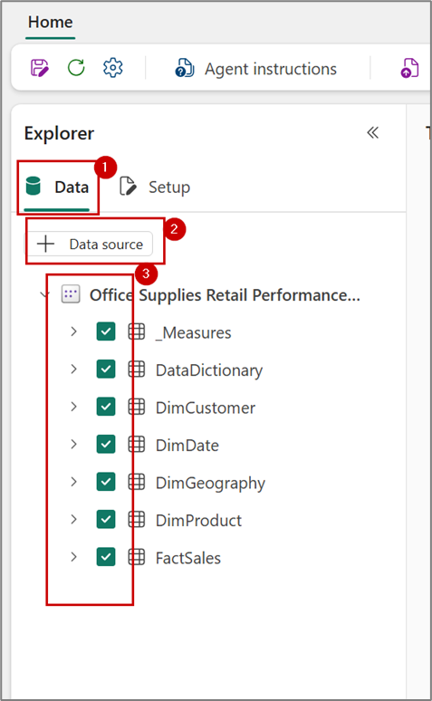

## Agent Instructions
Copy the response for item 15 (detailed instructions) and paste it into the agent’s instructions.
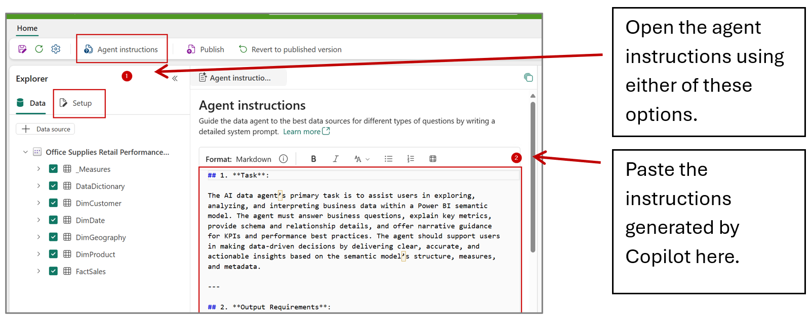

## Agent Description that is Visible to Users in Fabric/Power BI
Open agent settings and add the About > Description. Paste the response for item 16.
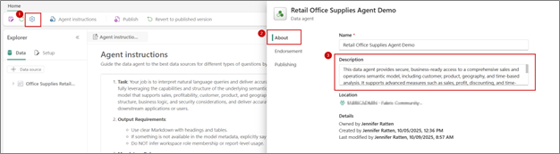

## Time to Test
###### Copy a test case from the response to item 18, paste it into the data agent chat, and send. Start with simple queries and increase complexity.
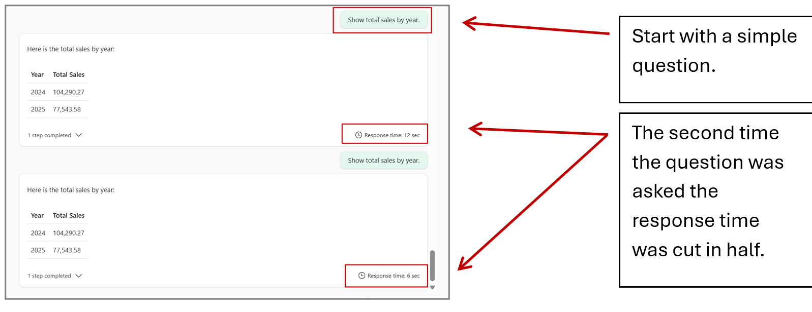
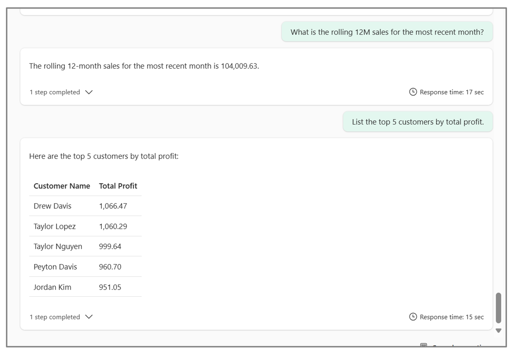
---
Pro Tip: The first couple of messages may take longer while your agent “warms-up”. The second time the question was asked, response time was cut in half. A lot of factors impact the response time (e.g. complexity of the question). This post oversimplifies for the sake of brevity. Look at out for a future post on this topic.
---
## Publish the Agent
When you are satisfied with the test results go ahead and publish the agent.
The description added here is what will be visible to automated processes and in external systems. After the agent is published this desciption can be accessed from the agent settings as well.
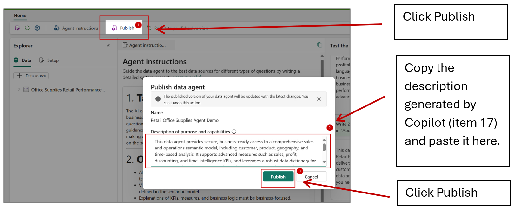

## Test the Agent in the Standalone Copilot Experience in Power BI
This step is not essential but I highly recommend it, so you can test the agent from the user’s perspective… see what your users will see.
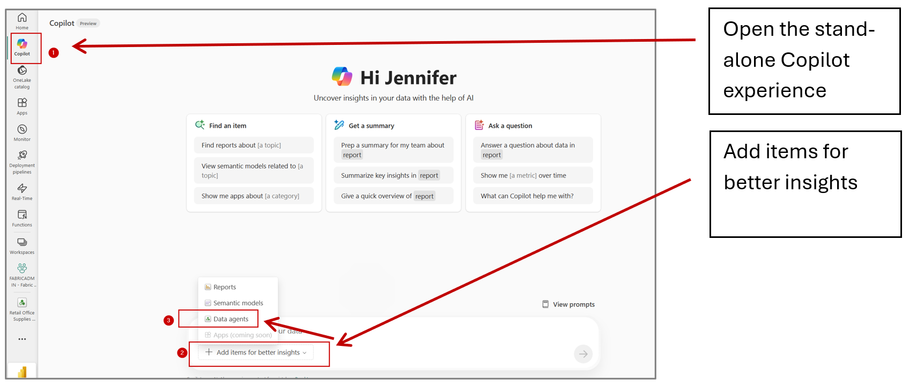
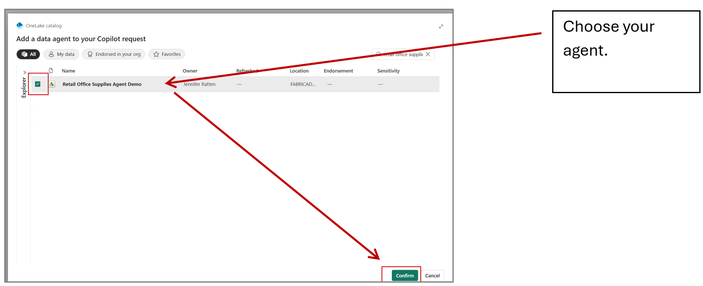
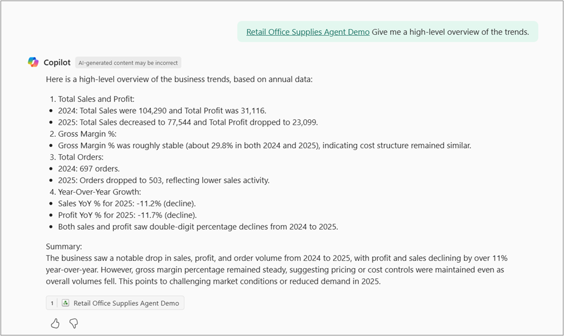
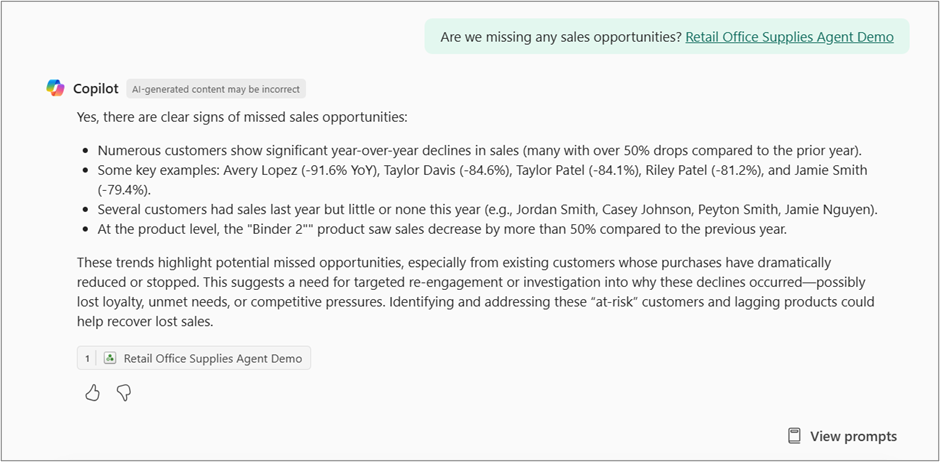
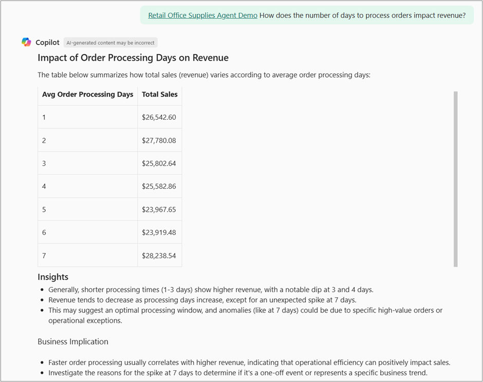

## Share the Agent
Now it’s time to wow others with your awesome data agent!
Head back to the workspace and choose who to share it with and what permissions they should have. More on sharing an permissions here: [Fabric data agent sharing and permission management (preview)](https://learn.microsoft.com/en-us/fabric/data-science/data-agent-sharing)
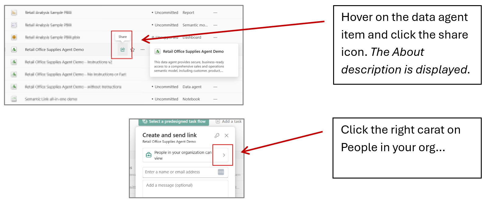
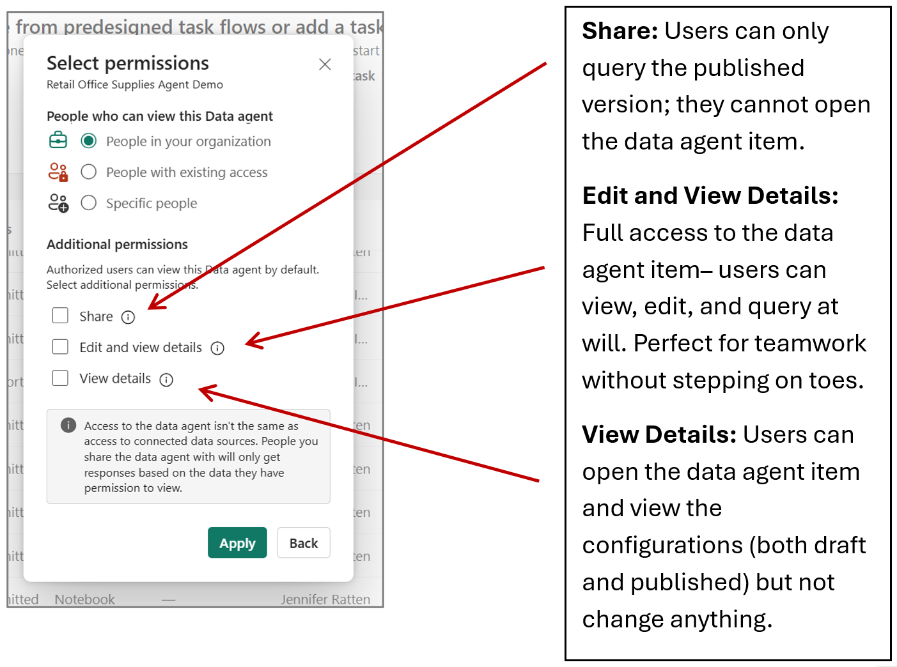

## Grant Build Permission on the Semantic Model
You’re in the driver’s seat with your Fabric data agent—just remember, when you share it, you also need to make sure the users can also access the underlying data. The agent strictly adheres to the underlying data’s Row-Level Security (RLS) and Column-Level Security (CLS). Interacting with the data agent essentially equates to executing custom queries on-demand, that means build permission is your golden ticket. Learn how to grant build permission on the model here: [Build Permission for Shared Semantic Models](https://learn.microsoft.com/en-us/power-bi/connect-data/service-datasets-build-permissions)

---
PRO TIP: If you have already shared the model’s reports with users through a Power BI App...
- First… GOLD STAR to you for using a best practice!
- Second… you can go back into the app configurations > audience and tick the box to allow the users to build with models used by the app. This will grant build permission to everyone in your audience in one click. If more than one model is referenced in the app for the audience, users get build access for all of them. Read more about Power BI apps here: [Publish an app in Power BI](https://learn.microsoft.com/en-us/power-bi/collaborate-share/service-create-distribute-apps)
---
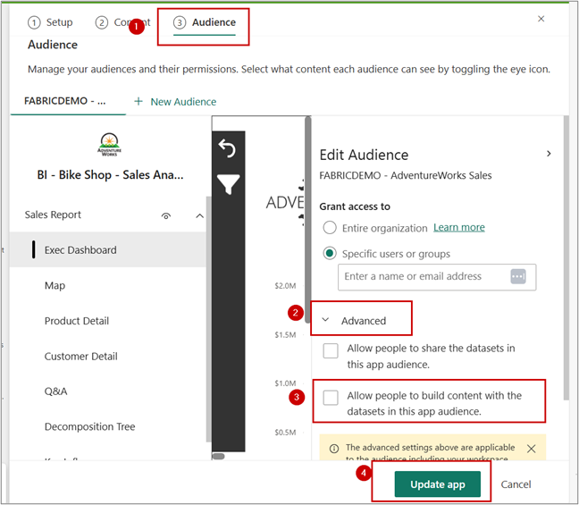

## Why This Works
- Copilot Knows Your Stuff: It instantly understands your semantic model—structure, measures, relationships, and all.
- AI-Ready Models = Happy Copilot: Clean names, curated measures, and no unused clutter mean Copilot delivers spot-on instructions and test cases.
- No More Manual Documentation: Forget digging through endless fields and writing instructions from scratch.
- Reusable Framework: This simple method has been tested and worked successfully on 6 semantic models of different content and subjects. Deploy agents like a pro!

## Items in Preview Can Change Without Notice
It is also important to note that the Fabric data agent item is till in preview, meaning the way it works and documentation surrounding it may change or be something other than expected during the preview period. The differences that I noticed were mainly involving the data agent item’s instructions in the Fabric workspace. For example, during the time spent writing this post, the agent instructions input has changed from plain text to markdown and its location has changed from appearing to the right of the chat to the left of the chat. Read more about the expectations here: [Create a Fabric data agent (preview)](https://learn.microsoft.com/en-us/fabric/data-science/how-to-create-datae simple steps, you’re not just building agents—you’re putting production-ready solutions in place almost as fast as you can say “no code required.” Whether you’re a data rookie or a seasoned engineer, this approach lets you skip the guesswork and manual documentation. Stop over-engineering and over-thinking your agent. Open your report, send some messages, and let Copilot do the heavy lifting. You will wow your team in no time!

## A Friendly Guide to Power BI and Fabric AI (Beginner to Expert)
This post is the first in a new series all about making Power BI and Fabric’s AI features work for you—no matter your background or skill level. Whether you’re a business user just getting started, a low-code developer looking for shortcuts, or a pro-code expert building advanced solutions, you’ll find practical tips and clear examples you can use right away. We’ll cover everything from using the built-in UI to creating scalable, custom solutions, all explained in a way that’s easy to follow and act on. So, wherever you are on your data and AI journey, you’re in the right place!

## Links to Documentation
- [Copilot in Power BI tutorial introduction](https://learn.microsoft.com/en-us/power-bi/create-reports/tutorial-copilot-power-bi-introduction)
- [Use Copilot with Power BI reports and semantic models](https://learn.microsoft.com/en-us/power-bi/create-reports/copilot-reports-overview)
- [Create a Fabric data agent (preview)](https://learn.microsoft.com/en-us/fabric/data-science/how-to-create-data-agent)
- [Consume a Fabric Data Agent from Copilot in Power BI (preview)](https://learn.microsoft.com/en-us/fabric/data-science/data-agent-copilot-powerbi)
- [Fabric data agent tenant settings](https://learn.microsoft.com/en-us/fabric/data-science/data-agent-tenant-settings)
- [Fabric data agent sharing & versioning](https://learn.microsoft.com/en-us/fabric/data-science/data-agent-sharing)
- [Standalone Copilot experience in Power BI (preview)](https://learn.microsoft.com/en-us/power-bi/create-reports/copilot-chat-with-data-standalone)
- [Enable Fabric Copilot for Power BI (tenant)](https://learn.microsoft.com/en-us/power-bi/create-reports/copilot-enable-power-bi)
- [Understand star schema and the importance for Power BI](https://learn.microsoft.com/en-us/power-bi/guidance/star-schema)
- [Publish an app in Power BI](https://learn.microsoft.com/en-us/power-bi/collaborate-share/service-create-distribute-apps)
- [Build Permission for Shared Semantic Models](https://learn.microsoft.com/en-us/power-bi/connect-data/service-datasets-build-permissions)

